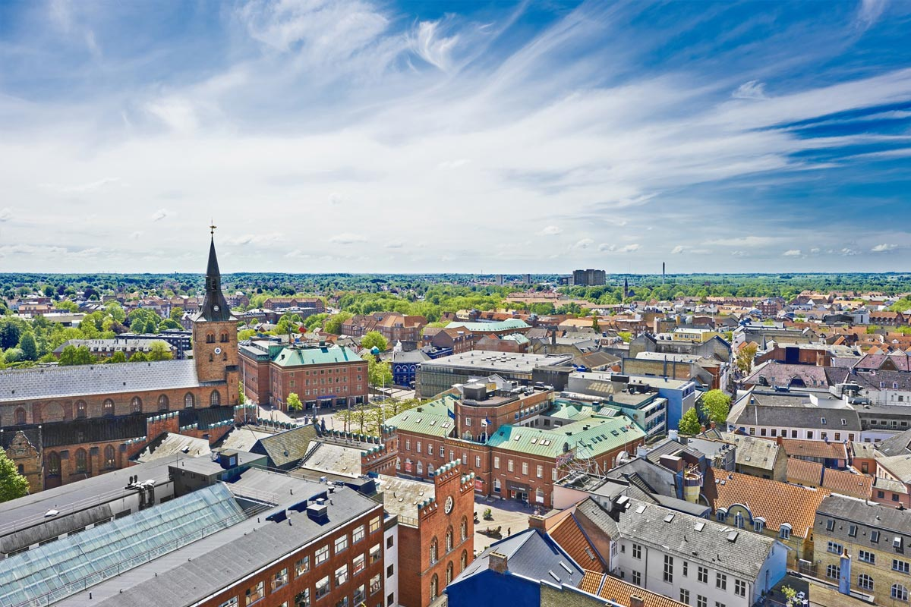
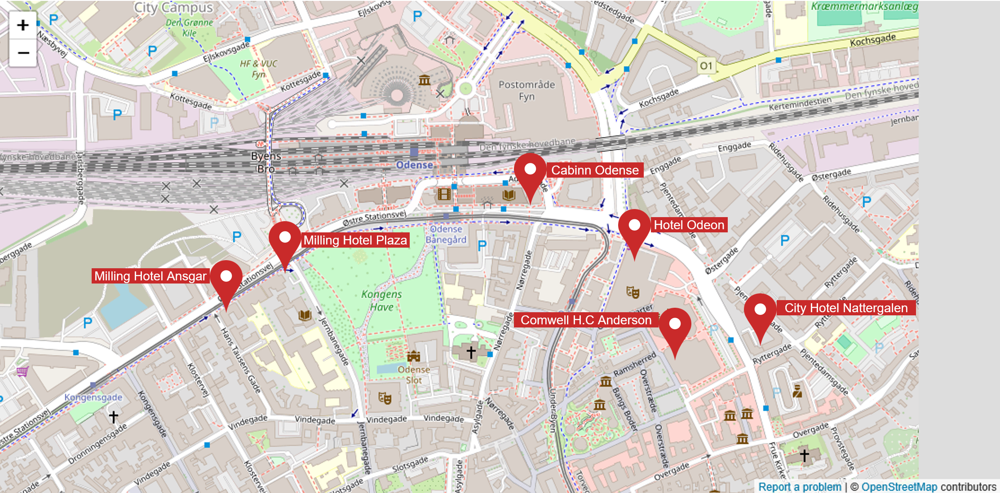

## About

**Robotics and Software Engineering 2025 (RSE'25)** is the fourth edition of an annual meeting to promote discussion and interaction between researchers. The main objective is to strengthen cooperation and dialogue, bringing together the communities of Robotics and Software Engineering. It is an ideal opportunity to exchange ideas on topics of interest, including (but not limited to): development of systems, software architecture, dependability, software reuse, software validation and verification, robot modeling, robot control architectures, autonomous systems, and multi-robot systems. For this reason, we encourage anyone to participate, particularly early career researchers, including master students doing research.

The format of RSE'25 meeting consists of short presentations from each participant with enough time for discussion. Researchers at different career stages are wellcome to present their research, provide and get feedback from peers, engage into discussions and establish new collaborations. RSE is not a publication venue. Participants can present previously published work as well as unpublished work, including early ideas and work in progress, can be a published paper, an idea, a master thesis, etc. The main point is to encourage discussions, to give and receive feedback, and to create a network for new collaborations.

RSE'25 will take place at the [University of Southern Denmark](https://www.sdu.dk/en), campus Odense, located in the island of Funen in Denmark, from **September 8 until September 11, 2025**.
RSE'25 does not require any paper submission, however, an abstract about the research that is to be presented is required to apply. 
 

## Application

> Please note that every participant needs to give a talk, this is the event rule.  



### Registration

We will notify the selected participants shortly after the deadline. A reasonable registration fee (ca. €200/participant) will be required to confirm your participation. The registration fee includes lunch, coffee and snacks during the coffee breaks, and the RSE dinner.

##  Schedule


 

## Venue



## Travel Information

### Odense

[Discover the charm of Odense](https://www.visitdenmark.com/denmark/destinations/fyn/odense), Denmark’s hidden gem! Step into the enchanting city that inspired the timeless fairy tales of Hans Christian Andersen. Wander through picturesque streets, explore historic landmarks, and immerse yourself in a rich cultural scene. Whether you're strolling through lush parks, visiting world-class museums, or enjoying vibrant cafes, Odense offers a perfect blend of tradition and modernity. Come experience the warmth, creativity, and welcoming spirit of Odense – a city where stories come to life!

### Accomodation

You can choose a hotel near the city centre. The meeting venue is easily reachable with the [tram](https://www.odenseletbane.dk/english) in [20 min](https://maps.app.goo.gl/dhE3wqxqSU5xLUot5).

Some hotels include:

- [Comwell H.C. Andersen Odense](https://comwell.com/hoteller/comwell-hotel-hc-andersen-odense)
- [Hotel Odeon](https://picassoonline.techotel.dk/da/occ/hotel-odeon/booking/)
- [City Hotel Nattergalen](www.cityhotelnattergalen.dk)
- [Milling Hotel Ansgar](https://millinghotels.dk/hoteller/milling-hotel-ansgar/)
- [Milling Hotel Plaza](https://millinghotels.dk/hoteller/milling-hotel-plaza/)
- [Cabinn Odense](https://www.cabinn.com/hotel/cabinn-odense)

## Privacy Policy

<b>SYDDANSK UNIVERSITET</b>

This Privacy Policy explains how Syddansk Universitet (the “Data Controller”) (“we” or “us”) processes your personal data.

### 1. DATA CONTROLLER

The legal entity responsible for processing your personal information is:

Syddansk Universitet Corp ID: 29283958

Campusvej 55

5230 Odense

Denmark

### 2. DESCRIPTION OF THE PROCESSING

In connection with RSE 2025, SDU wants to collect information about you. SDU is Data Controller and will ensure that the data is processed in accordance with GDPR.

In connection hereto, SDU is obligated to inform you about the processing of your personal data.

The following personal data is processed: First name, surname, address, company/institution, position, VAT number, food preferences, IP-addresses, payment information, photos and videos.

<b>Purposes of the Processing</b>

We process your personal data to register your participation in RSE 2025, as well as sending you relevant information on important topics, such as changes in program. Furthermore, we process the provided data in order to validate whether you are eligible for any participant specific ticket discounts.

<b>Lawfulness of Processing</b>

The information is to be processed in compliance with the General Data Protection Regulation Art. 6(1)(b) and (e).

<b>This is How we Use Personal Data</b>

SDU is responsible for processing your personal data and will keep your information confidential under existing laws. Your information will only be used for the purpose described above and will not be accessible to unauthorized persons.

SDU will delete the information when it is no longer relevant to keep it. Your information will be deleted at SDU no later than March 11th 2026. <b>Your rights</b>

You have the right to request insight, rectification or deletion of your personal data

You have the right to oppose the processing of your personal data and have the processing of personal data limited

You have an unconditional right to oppose your personal data is used for marketing If the processing of your personal data is based on your approval, you have the right to withdraw that approval at any time. Your withdraw has no influence on the legal basis for processing done prior to your withdraw.

You have the right to receive the personal data you have given in a structured and normally used and machine-readable format (data portability)

<b>Publication</b>

Photos and videos will be published, where you may be able to be identified.

<b>Disclosure</b>

Your data can be disclosed to third parties, including but not limited to RSE organizers, participants, sponsors, exhibitors, restaurants, transportation companies.

<b>Further Information</b>

If you have any questions, you can contact mica@mmmi.sdu.dk at any time.

If you have any question about data protection and your rights, please contact our DPO, Simon Kamber on email: dpo@sdu.dk.

If you want to complain about the processing of personal data, you may contact the Danish Data Protection Agency via www.datatilsynet.dk.

## Contact 
  


## Sponsor

